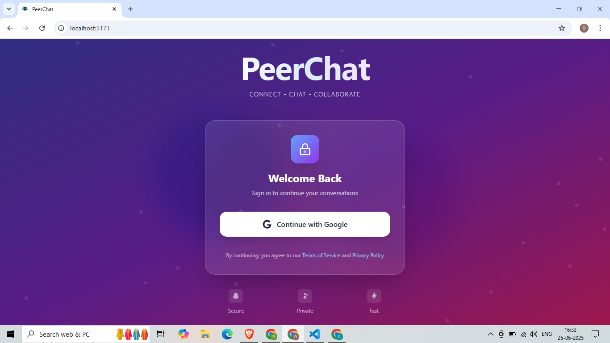
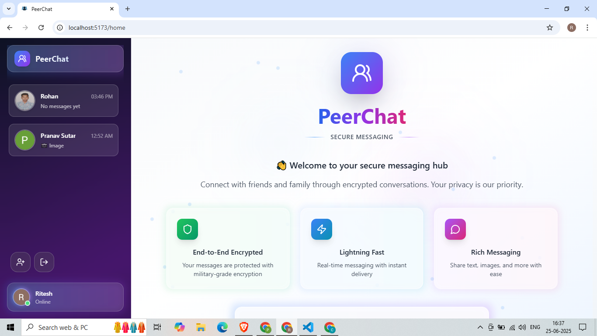
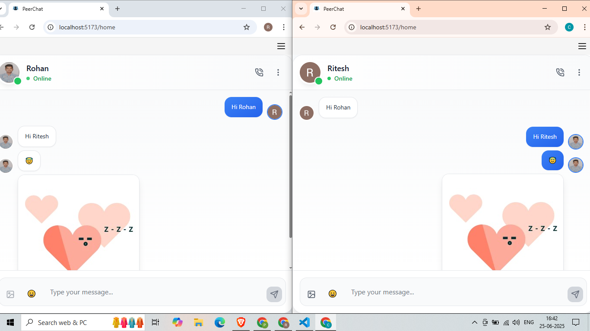

# 💬 PeerChat

PeerChat is a real-time chat application built using **React**, **Firebase**, and **Aceternity UI**, offering a beautiful, responsive UI with modern chat features.

---

## 🚀 Features

### 🔐 Authentication
- Login with Google (Firebase Auth)
- Persistent login session
- Real-time online/offline status tracking

### 💬 Messaging
- Realtime 1-on-1 private messaging
- Text message support
- Emoji picker (with support for modern emoji libraries)
- Timestamp for each message
- "Last Seen" feature

### 📸 Media Sharing
- Upload and send images instantly
- Preview uploaded images before sending
- All images are stored securely using **Firebase Storage**

### 😀 Emoji Support
- Integrated emoji picker for expressive messaging
- Emojis rendered directly into chat messages

### 👥 User Interface
- Modern responsive UI with **Aceternity UI**
- Animated buttons, dropdowns, modals, and hover effects
- Light & dark theme support
- Beautiful Google-style login button with spinner loading states
- Gradient highlights, blur effects, and smooth transitions

### 🧑‍💼 Profile Management
- Edit name and profile picture
- Upload profile image (with preview)
- Stored and synced using Firebase

### 📋 Chat Management
- Add users to your chat list
- Real-time list updates
- Clear chat history per conversation

---

## 🛠️ Tech Stack

- **Frontend**: React (with Vite), Aceternity UI,Tailwind CSS,
- **Backend**: Firebase (Auth, Firestore, Storage)
- **State Management**: Context API
---

## 🖼️ Screenshots

### 🔐 Login Page

### 😄 Home

### 💬 Chat UI
